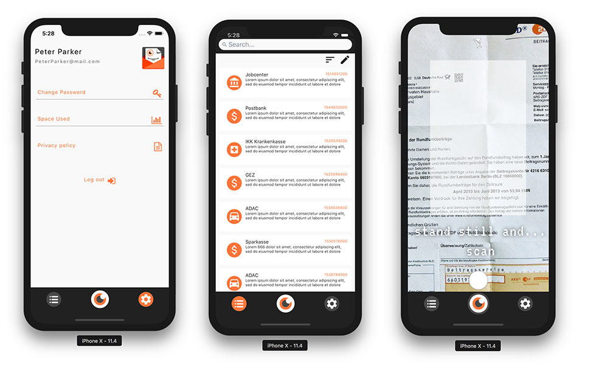

<table>
<tr>
<td> <td>
<td><h1>  OrgaNice - outsource your bureaucracy</h1> <td>
</tr>
</table>

> Have you ever been annoyed by reading letters while being on the stairs - the way up to your flat? Did you read just a tiny bit and didn't get the meaning of the letter while walking?
This time is over - now you just scan the letters and let the artificial-intelligence do the thinking. 

This project consists out of two projects. This frontend and a seperated [backend](https://github.com/DigitalCareerInstitute/organice-backend) which acts as a API.
## Table of Contents

- [Installation](#installation)
    - [Prerequisites](#prerequisites) 
- [Usage](#usage)
- [Contributing](#contributing) <td>

 

## Installation
To set up the React native developement environment on Ubuntu we found very few tutorials and just this worked in the end:

[Setup React-Native development environment](https://www.youtube.com/watch?v=gzaH-UvWGzU&list=PL2g-DF7-WOZ4pzupMZfBJiDEh_OLRvBRy)

### Prerequisites

If you come from Ubuntu you likely wanna use a android emulator, on mac osx use `xcode`. Xcode installation was pretty easy, so we cover just the complicated Linux instructions.
* Ubuntu 16.04
* Java 8 SDK
* Node & NPM
* React Native CLI
* Android Studio
* Android Virtual Device
* Optional if its not working: Enabled `virtual technology` in BIOS. 

### Android Studio and SDK location

Download Android Studio Extract the zip into `/opt/android-studio` and run the `/opt/android-studio/studio.sh` to start the Android Studio. It is important to change the SDK directory. `/root/Android/Sdk` will not work because of permissions. Change it to your home directory eg: `/home/username/Android/Sdk`
### Download required SDKs

Select the required packages:

* Android 6.0 Marshmallow
* Google APIs
* Android SDK Platform 23
* Sources For Android 23
* Intel x86 Atom System Image 

## Usage

To start the application run 

`npm start`

and choose which emulator you need or if you want to stream it to a real device. 

To run directly on a specific environment, run 

`npm run android` or `npm run ios`.

## Contributing

This project is open source on github. Issues are listed in the frontend repository. Please [open an issue](https://github.com/DigitalCareerInstitute/organize-frontend/issues/new) for support.

